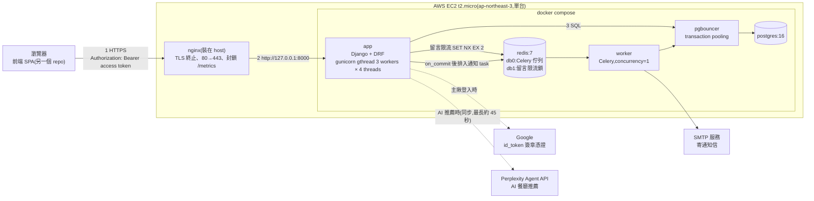
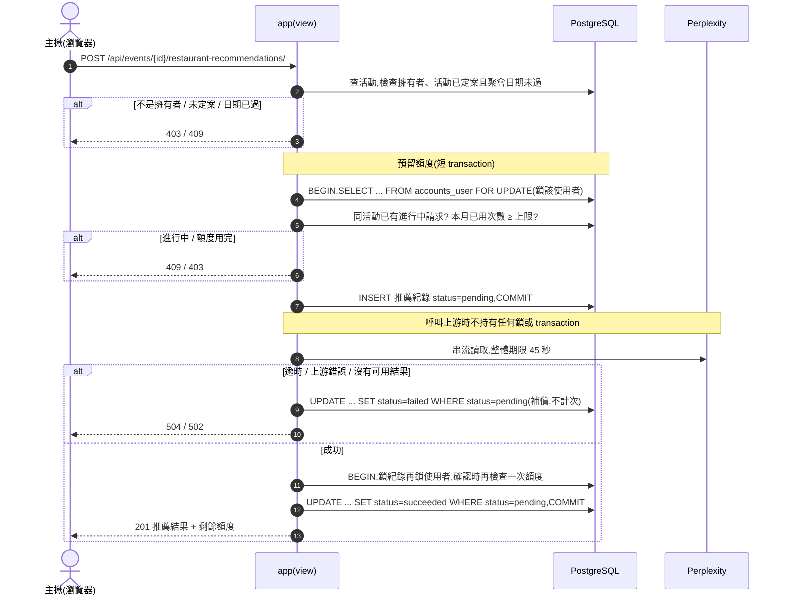
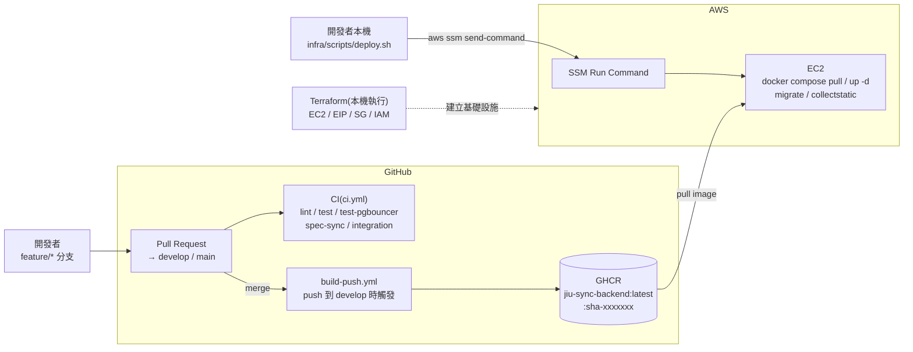
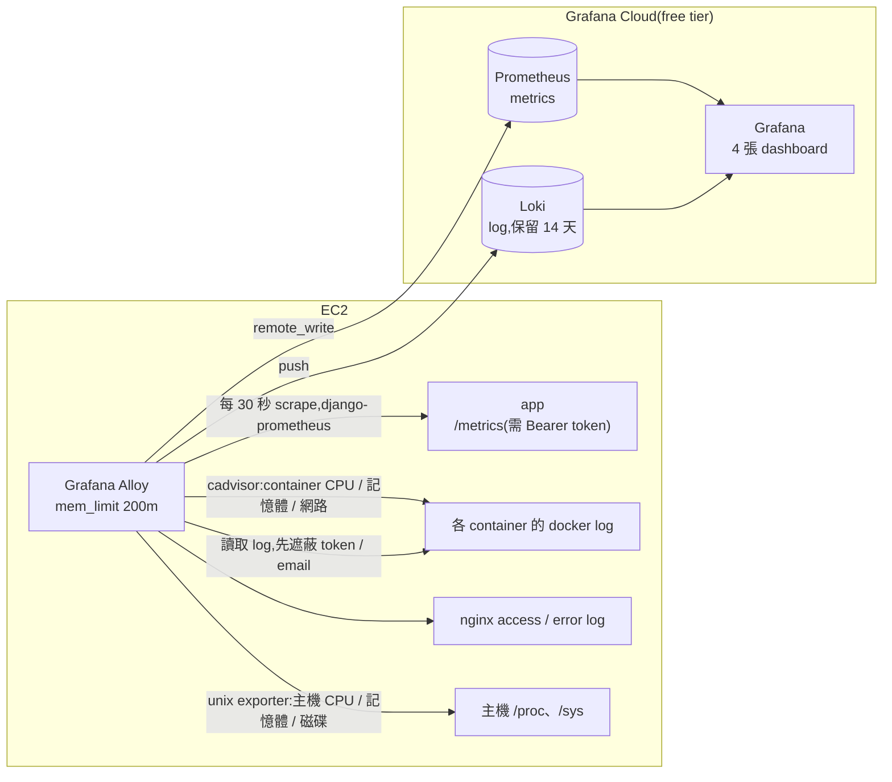

# 1. 應用程式架構

揪甘心讓主揪建立活動、分享連結,參與者免登入投票選時段。後端負責活動資料、投票彙整、活動生命週期(定案、取消、重新開放)、通知信,以及定案後的 AI 餐廳推薦。

本章分成三個視角:

- **執行期視角**:一個請求如何穿過正在運作的系統。
- **建置與部署視角(CI/CD)**:程式碼如何從 PR 變成正式環境上跑的 container。
- **可觀測性視角**:系統的 metrics 與 log 如何被收集,以及為什麼它放在請求路徑之外。

## 1.1 執行期視角

1. **瀏覽器 → nginx。** 前端以 HTTPS 呼叫 `https://56-155-65-244.sslip.io/api/...`。需要主揪身分的 API 帶 `Authorization: Bearer <access token>`;參與者 API 不需要登入。
2. **nginx → app。** nginx 是唯一對外的服務,做 TLS 終止後轉給只綁在 `127.0.0.1:8000` 的 app container,同時帶上 `X-Forwarded-For`、`X-Forwarded-Proto`。
3. **app → 資料庫。** Django 經 PgBouncer 連 Postgres。PgBouncer 用 transaction pooling,讓少量的 Postgres 連線服務較多的 app 執行緒。
4. **非同步工作。** 需要寄信的動作(建立、定案、取消、重新開放),在資料庫 transaction commit 之後才把 task 排進 Redis,由 Celery worker 寄出。寄信失敗不會讓原本的 API 失敗。
5. **外部服務。** 只有兩個請求會呼叫外部服務:主揪登入(驗證 Google id_token)與 AI 餐廳推薦(呼叫 Perplexity)。

### 關鍵流程:AI 餐廳推薦(`POST /api/events/{id}/restaurant-recommendations/`)

這是系統裡最複雜的請求:它呼叫要付費、又可能很慢的外部服務,同時要保證每人每月的額度不被超用。

重點:

- **pending 紀錄本身就是額度的預留。** 在呼叫上游前先佔一個名額,同一使用者的併發請求會在「使用者列鎖」內看到它,不會同時超用。
- **呼叫上游期間不鎖資料庫。** 上游可能要幾十秒,若此時持有鎖,同一使用者的其他操作都會被卡住。
- **失敗就補償。** 失敗時把 pending 改成 failed,不計入次數;pending 超過 5 分鐘也自動不再計入(避免程序當掉時名額被永久佔住)。
- **狀態只會轉換一次。** 所有轉換都用 `UPDATE ... WHERE status='pending'`,由資料庫保證成功與失敗兩條路徑不會互相覆蓋。

## 1.2 建置與部署視角(CI/CD)

**CI(`.github/workflows/ci.yml`,PR 到 `main`/`develop` 時執行)**

| Job | 檢查什麼 |
| --- | --- |
| `lint` | `ruff check .` |
| `test` | `makemigrations --check`(model 與 migration 不一致就失敗)、`migrate`、`pytest --cov`,搭配真的 Postgres 16 與 Redis 7 |
| `test-pgbouncer` | 經 PgBouncer(transaction pooling)再跑一次全套測試,確認程式碼沒有用到 transaction pooling 不支援的功能 |
| `spec-sync` | PR 若改了 `apps/**` 或 `config/**`,卻沒有改 `openspec/specs/**` 或 `openspec/changes/**`,直接失敗 |
| `integration` | 啟動 server、輪詢 `/healthz/` 直到 200,再跑 k6 smoke test |

**CD(目前為半自動,後續補上)**

- **建置自動化**:PR 合併進 `develop` 後,`build-push.yml` 以 `ENV=prod` 建置 image,推到 GHCR,同時標上 `latest` 與 `sha-<7 碼>`。
- **部署手動觸發**:開發者在本機執行 `infra/scripts/deploy.sh`。腳本不使用 SSH(EC2 沒有開 22 port,也沒有 key pair),而是透過 `aws ssm send-command` 在 EC2 上執行:
  1. 檢查 `/opt/jiu-sync-backend/.env` 存在,且有 `GHCR_*`、`DATABASE_URL_DIRECT`,缺少就中止,不動正在跑的服務。
  2. 把 repo 裡的 `docker-compose.prod.yml` 與 Alloy 設定以 base64 寫到 EC2(EC2 上沒有 repo,也不需要 git 憑證)。
  3. `docker compose pull`、`up -d`、`restart alloy`。
  4. `migrate`(直連 Postgres,繞過 PgBouncer)、`collectstatic`。
- 重複執行是安全的:image 沒變時 `pull` 不做事,`up -d` 也不會重啟沒有變動的服務。

> **待補:CD 全自動部署。** 「image 推上 GHCR 後自動觸發部署」目前刻意不在範圍內(`openspec/changes/deploy-django-app/design.md` Non-Goals),會在之後的 change 補上。完成後請更新本節的流程圖。

**基礎設施(Terraform,`infra/terraform/`)**:在 `ap-northeast-3`(大阪)建立 t2.micro(Ubuntu 24.04,20GB gp3)、Elastic IP、只開 80/443 的 Security Group,以及只有 `AmazonSSMManagedInstanceCore` 權限的 instance profile。目前在本機手動執行 `terraform apply`,state 也存在本機。

## 1.3 可觀測性視角

可觀測性系統**放在請求路徑之外**,當成旁路:它只會讀取 app、container、主機與 nginx 的資料,任何服務都不依賴它。Alloy 掛掉或 Grafana Cloud 連不上時,API 照常運作,部署也照常完成(`deploy.sh` 對缺少的觀測設定只印警告,不中止)。

| 層 | 收集什麼 | 來源 |
| --- | --- | --- |
| App | 每個 view 的請求數、p50/p95 延遲、4xx/5xx 比例、AI 推薦延遲 | `django-prometheus`(gunicorn multiprocess mode),`/metrics` 以 `METRICS_TOKEN` 保護 |
| Container | 各 container 的 CPU、記憶體、網路、重啟次數 | Alloy 內建 cadvisor |
| 主機 | CPU、可用記憶體、swap、磁碟、網路、load | Alloy 內建 unix exporter |
| Log | 所有 container 的 stdout/stderr、nginx log | Alloy 的 docker / file 來源,送出前遮蔽 Bearer token、JWT、email |

Dashboard JSON 放在 `infra/grafana/dashboards/`(App、Containers、Host、Logs 四張)。告警(收不到 metrics、可用記憶體不足、5xx 比例過高、container 重啟)尚待建立,見 `openspec/changes/add-observability-stack/tasks.md` task 4.2。

## 1.4 元件一覽

| 元件 | 在哪裡執行 | 職責 |
| --- | --- | --- |
| nginx | EC2 host(不在 compose 內) | TLS 終止(Let's Encrypt,certbot 自動續期)、HTTP→HTTPS、反向代理、對外封鎖 `/metrics`。設定的參考副本在 `infra/nginx/` |
| `app` | compose | Django 6.1 + DRF,gunicorn `gthread`(3 workers × 4 threads,共 12 個可同時處理的請求) |
| `apps.accounts` | app | Google SSO 登入、JWT 核發、refresh token 換發與撤銷、`GET /api/me/` |
| `apps.events` | app | 活動 CRUD、參與者投票/核對身分/改票、留言板、定案/取消/重新開放、輕量輪詢 |
| `apps.recommendations` | app | AI 餐廳推薦、每月額度、選定餐廳;引擎抽象層(`engines/base.py`)目前實作 Perplexity |
| `apps.notifications` | worker | 四種通知信的 Celery task |
| `config/exceptions.py` | app | 全站統一的錯誤格式與錯誤 log |
| `worker` | compose | Celery worker,同一個 image,`--concurrency=1` |
| `pgbouncer` | compose | 連線池,`DEFAULT_POOL_SIZE=10`、`MAX_CLIENT_CONN=100` |
| `db` | compose | PostgreSQL 16,資料存在 named volume `postgres_data`(EC2 根磁碟上) |
| `redis` | compose | Celery broker(db 0)、留言限流鎖(db 1) |
| `alloy` | compose | 收集 metrics 與 log,推到 Grafana Cloud |

## 1.5 主要請求流程

- **主揪登入。** 前端取得 Google id_token,送到 `POST /api/auth/google/`。後端驗證簽章、audience、issuer、email 是否已驗證,建立或找到使用者後,回傳 access token(body)並以 HttpOnly cookie 下發 refresh token。細節見第 5 章。
- **建立活動。** `POST /api/events/` 建立活動與最多 20 個候選時段,回傳 `{id, shareUrl}`,並在 commit 後排入「分享連結寄給自己」的通知信。活動 id 是 8 碼隨機 base62,不可猜。
- **參與者投票與改票。** `POST /api/events/{id}/responses` 首次投票(暱稱 + 手機末三碼,末三碼以雜湊儲存)。改票要先 `POST .../responses/verify` 核對身分,換到一組 30 分鐘、只能用一次的存取憑證,再 `PATCH .../responses/{responseId}`。
- **狀態變化同步。** 前端每 10 秒呼叫 `GET /api/events/{id}/poll`,只拿「有沒有變化」的摘要;有變化才重新拉完整資料。
- **定案 / 取消 / 重新開放。** 擁有者呼叫對應端點,狀態以條件式 UPDATE 轉換,commit 後寄信通知留過 email 的參與者與主揪。
- **AI 推薦與選定餐廳。** 見 1.1 的時序圖;選定餐廳 `PUT .../selected-restaurant/` 在活動列鎖內寫入,重送同一間不會重複寫入。

## 1.6 設計決策

- **單機 compose,先控制成本。** 一台 t2.micro 跑完整個後端,所有元件容器化。這是 MVP 階段的刻意取捨,代價是只能垂直擴展、沒有高可用,詳見第 3 章與第 6 章。
- **app 本身不保存狀態。** API 用 JWT 認證,不依賴 server session;需要保存的東西都在 Postgres 或 Redis。之後把資料庫與 Redis 搬出這台機器,app 就能直接水平複製。
- **附屬功能不能拖垮主功能。** 通知信、留言限流、可觀測性壞掉時,API 照常運作(fail-open 或旁路設計)。
- **資料庫負責最後一道一致性保證。** 狀態轉換、一次性憑證消費、額度預留都用條件式 UPDATE 或列鎖,不只靠 Python 程式碼的檢查。
- **規格驅動開發。** 每個功能都有 `openspec/changes/<name>/` 的 proposal、design、tasks,CI 的 `spec-sync` 擋下沒有同步更新規格的實作變更。
