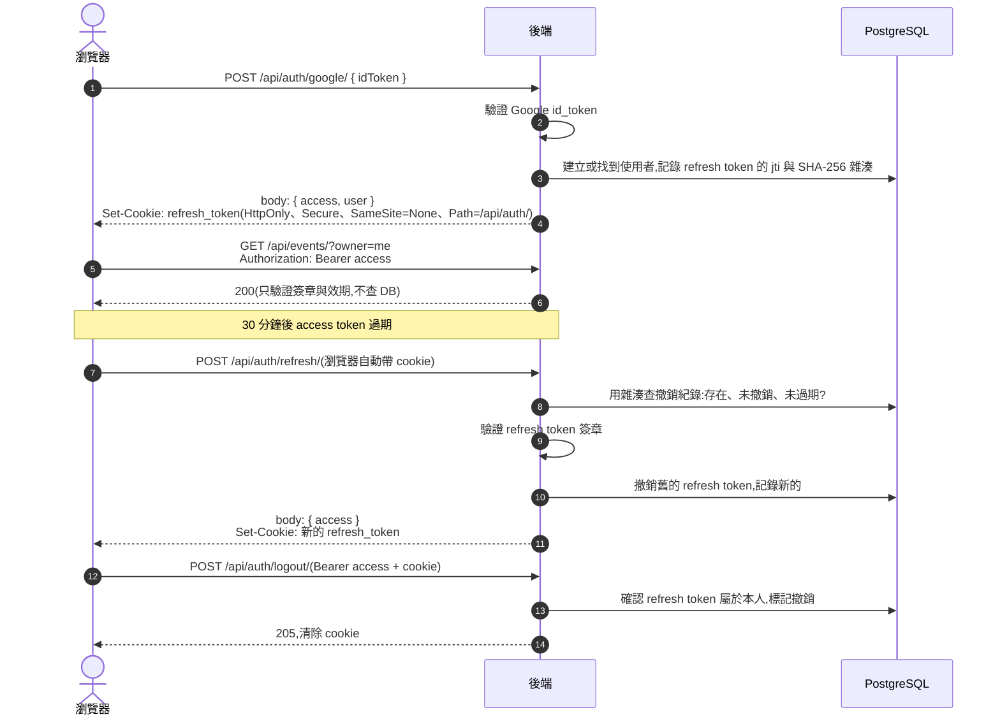

# 5. 安全性設計

揪甘心保存的資料包括:主揪的 Google 帳號(email、名稱、頭像)、活動內容、參與者的暱稱、選填的 email,以及手機末三碼(雜湊後)。另外,AI 推薦每呼叫一次都要付費。因此最重要的風險是:

- **主揪帳號被冒用**:別人管理、定案或取消你的活動,或用掉你的 AI 額度。
- **參與者身分被冒用**:別人改掉你的投票。
- **個人資料外洩**:參與者的 email、主揪的聯絡信箱被其他人看到。
- **公開端點被濫用**:免登入的投票、留言被洗版,或付費的 AI 被大量呼叫。
- **機密外洩**:資料庫密碼、`SECRET_KEY`、各種 API token。

本章依序說明每項風險的處理方式,最後列出尚未處理的風險。

## 5.1 一覽

| 風險 | 狀態 | 怎麼處理 |
| --- | --- | --- |
| 偽造的 Google 登入 | 已處理 | 驗證簽章、audience、issuer、有效期限,並要求 email 已被 Google 驗證 |
| refresh token 被 XSS 偷走 | 已處理 | 放在 `HttpOnly` cookie,JavaScript 讀不到 |
| 資料庫外洩導致 token 可直接使用 | 已處理 | refresh token 與改票憑證只存 SHA-256 雜湊 |
| 管理別人的活動 | 已處理 | 每個管理端點都檢查「是否為活動擁有者」 |
| 猜出活動網址 | 已處理 | 活動 id 是 8 碼隨機 base62(約 2.18 × 10¹⁴ 種) |
| 參與者 email 外洩 | 已處理 | 公開的活動詳情不回傳參與者 email;主揪 email 只回給擁有者;通知信一人一封 |
| SQL injection | 已處理 | 全部透過 Django ORM,參數化查詢 |
| 傳輸被竊聽 | 已處理 | 全站 HTTPS、HSTS、HTTP 自動轉址 |
| `/metrics` 外洩內部資訊 | 已處理 | Bearer token + nginx 對外回 404 |
| 送到第三方的 log 帶有機密 | 已處理 | Alloy 送出前遮蔽 Bearer token、JWT、email |
| **手機末三碼被暴力嘗試** | **未處理** | 見 5.8 第 1 項 |
| **限流可以被繞過** | **未處理** | 見 5.8 第 2 項 |
| **`/admin/` 對外公開** | **未處理** | 見 5.8 第 3 項 |

## 5.2 主揪登入:Google SSO

主揪**只能**用 Google 帳號登入,系統不提供帳號密碼註冊,一般使用者也沒有可用的密碼(`set_unusable_password()`)。

前端拿到 Google 簽發的 id_token 後,送到 `POST /api/auth/google/`。後端在 `apps/accounts/services.py` 依序檢查:

1. **簽章與有效期限**:`google-auth` 用 Google 公開的憑證驗證 token 確實由 Google 簽發,而且還沒過期。
2. **`aud`(這個 token 是發給誰的)** 必須等於本系統的 `GOOGLE_OAUTH_CLIENT_ID`。別的網站拿到的 Google token 不能拿來登入這裡。
3. **`iss`(誰簽發的)** 必須是 Google。
4. **`sub`(Google 帳號的固定 id)** 必須存在。系統以 `sub` 識別使用者,不用 email,因為 email 可能變更。
5. **`email` 必須存在、格式正確,且 `email_verified` 為 true。**

任何一項不通過都回 401 `INVALID_ID_TOKEN`。

## 5.3 JWT:登入之後怎麼證明「我是我」

登入成功後,系統不再每次都問 Google,而是發給前端兩種 token。可以把它們想成:

- **access token = 短效通行證。** 每次呼叫需要登入的 API 時,放在 `Authorization: Bearer <token>` header 中。效期 **30 分鐘**。
- **refresh token = 換證用的憑證。** 只用來換新的 access token。效期 **14 天**。

### 兩種 token 的比較

| | access token | refresh token |
| --- | --- | --- |
| 用途 | 呼叫 API | 換發新的 access token |
| 效期 | 30 分鐘 | 14 天 |
| 前端怎麼拿到 | 登入與換發 API 的回應 body | `Set-Cookie`,前端 JavaScript 讀不到 |
| 怎麼送回後端 | `Authorization: Bearer` header | 瀏覽器自動帶上 cookie,只有 `/api/auth/` 路徑會帶 |
| 後端怎麼驗證 | 只驗證簽章與效期,不查資料庫 | 先查資料庫的撤銷紀錄,再驗證簽章 |
| 能否提前撤銷 | 不能,只能等它過期 | 可以(登出、換發時舊的會被撤銷) |

### 流程

### 為什麼這樣設計

- **refresh token 放在 `HttpOnly` cookie。** 就算網站出現 XSS 漏洞,攻擊者的腳本也讀不到 refresh token。最多只能偷到 access token,而它 30 分鐘後就失效。如果兩者都放在 `localStorage`,一次 XSS 就能拿到 14 天的登入狀態(`openspec/changes/archive/2026-09-13-refresh-token-httponly-cookie/`)。
- **cookie 只在 `/api/auth/` 路徑送出。** 一般 API 請求不會帶上 refresh token,減少曝露的機會。
- **每次換發都換一組新的 refresh token(rotation)。** 舊的立刻撤銷。refresh token 被偷之後,只要合法使用者先換發過一次,偷到的那組就失效了。
- **資料庫只存雜湊。** 撤銷紀錄只存 `jti` 與 SHA-256 雜湊,不存原始 token。資料庫外洩時,攻擊者拿不到可以直接使用的 refresh token。refresh token 是高熵亂數,不像密碼會被重複使用,所以不需要加 salt。
- **access token 不查資料庫。** 驗證快,但代價是無法提前撤銷:登出後,手上的 access token 最多還能用 30 分鐘。這是用 30 分鐘的短效期換取效能的取捨。
- **`SameSite=None`。** 前端與後端在不同網域,cookie 需要跨站送出。搭配 `Secure`(只走 HTTPS)與 CORS 白名單使用。

## 5.4 參與者身分:暱稱 + 手機末三碼

參與者不註冊,所以用「暱稱 + 手機末三碼」當作輕量的身分證明:

- **末三碼不存明碼。** 以 Django 的密碼雜湊(含 salt)儲存。末三碼只有 1,000 種組合,如果用不加 salt 的快速雜湊,資料庫外洩後瞬間就能被還原。
- **核對失敗不洩漏資訊。** 「暱稱不存在」和「末三碼錯誤」回同一個 401;暱稱不存在時仍做一次雜湊比對,讓兩者的回應時間差不多,無法用來探測暱稱是否存在。
- **改票憑證短效且只能用一次。** 核對成功後發一組 `secrets.token_urlsafe(32)` 的憑證,資料庫只存 SHA-256 雜湊,30 分鐘內有效,用一次就失效。消費時用條件式 UPDATE,兩個請求同時用同一組憑證,只有一個會成功。
- **憑證先驗證,再檢查活動狀態。** 帶著無效憑證的請求一律回 401,不會因為看到 409、410 的差異而推敲出活動目前的狀態。

這套機制可以擋住「不小心改到別人的票」,但擋不住有心人逐一嘗試 1,000 種組合,見 5.8 第 1 項。

## 5.5 權限控管

| 誰 | 可以做什麼 |
| --- | --- |
| 任何人(有活動連結) | 查看活動、投票彙整、留言;投票、核對身分;留言 |
| 參與者本人(持有效的改票憑證) | 修改自己的投票 |
| 已登入主揪 | 建立活動、查看自己的活動列表、查詢 AI 額度 |
| 活動擁有者 | 編輯、定案、取消、重新開放活動;刪除留言;AI 推薦;選定餐廳 |

- 預設權限是「需要登入」(`DEFAULT_PERMISSION_CLASSES = IsAuthenticated`)。公開端點必須在 view 上明確宣告 `AllowAny`,忘記宣告時是比較安全的「需要登入」。
- 擁有者檢查一律比對 `request.user` 與 `event.owner`。建立活動時,擁有者與主揪 email 取自登入身分,不採信請求內容。
- 參與者端點設定 `authentication_classes = []`,即使帶了 Authorization header 也不解析,避免公開端點因為一個壞掉的 token 而回 401。
- AI 推薦紀錄與選定餐廳都檢查「屬於這個活動」。用別的活動的推薦紀錄 id,一律回同一個 400,不透露它是否存在。

## 5.6 API 與傳輸安全

- **輸入驗證。** DRF serializer 限制每個欄位的長度與數量:活動標題 30 字、說明 50 字、地點 200 字、暱稱 40 字、留言 200 字、候選時段最多 20 個。AI 偏好條件中的選項類欄位只接受固定的值。
- **SQL injection。** 全部透過 Django ORM 查詢,沒有手寫拼接 SQL。
- **HTTPS。** nginx 用 Let's Encrypt 憑證(certbot 自動續期),HTTP 一律 301 轉到 HTTPS。Django 端 `SECURE_SSL_REDIRECT`、HSTS 30 天、`Secure` cookie,並依 nginx 帶的 `X-Forwarded-Proto` 判斷原始請求是否為 HTTPS。
- **CORS。** 只允許 `CORS_ALLOWED_ORIGINS` 明列的網域,並允許帶 cookie。django-cors-headers 本身禁止「允許所有網域」與「允許帶 cookie」同時開啟。
- **CSRF。** 一般 API 用 `Authorization` header 認證,瀏覽器不會自動帶上,所以不受 CSRF 影響。唯一靠 cookie 的是 `/api/auth/refresh/`:惡意網站即使觸發它,也會被 CORS 擋住而讀不到新的 access token。
- **正式環境啟動檢查。** `config/settings/prod.py` 在 `DJANGO_ALLOWED_HOSTS` 未設定、`DJANGO_SECRET_KEY` 為預設值,或 `FRONTEND_BASE_URL` 未設定時拒絕啟動。

## 5.7 機密與基礎設施

**網路曝露面**

- Security Group 只開 80 與 443。EC2 沒有開 22 port,也沒有 SSH key pair,維運一律透過 AWS SSM。
- app container 只綁在 `127.0.0.1:8000`,只有 nginx 能連到;Postgres、Redis、PgBouncer 沒有對主機開放任何 port。
- EC2 的 IAM role 只有 `AmazonSSMManagedInstanceCore`。

**機密管理**

- 正式環境的機密放在 EC2 上的 `/opt/jiu-sync-backend/.env`,透過 SSM session 手動建立,不進 git,也不會被打包進 image(`.dockerignore` 排除 `.env` 與 Terraform state)。
- GHCR 推送 image 使用 GitHub Actions 內建的 `GITHUB_TOKEN`,每次執行自動產生、結束即失效。
- Terraform state 存在開發者本機,`.gitignore` 排除 `*.tfstate`。

**可觀測性相關**

- `/metrics` 需要 `Authorization: Bearer <METRICS_TOKEN>`,以 `hmac.compare_digest` 比對;沒設定 token 時一律回 404(fail-closed),外部看起來和不存在的路徑一樣。nginx 另外對外回 404,作為第二道防線。
- Alloy 只拿到 6 個它需要的環境變數,拿不到資料庫密碼與 `SECRET_KEY`。Grafana Cloud token 只有 `metrics:write`、`logs:write` 權限。
- log 送到 Grafana Cloud 前,遮蔽 Bearer token、JWT 與 email。

## 5.8 尚未處理的風險(依嚴重程度排序)

1. **手機末三碼可以被暴力嘗試。** 末三碼只有 1,000 種組合,`POST .../responses/verify` 沒有任何嘗試次數限制。知道某位參與者暱稱的人(暱稱在活動頁上是公開的),最多試 1,000 次就能改掉他的投票。而且每次嘗試都要做一次較慢的密碼雜湊,大量嘗試也會吃掉伺服器 CPU。
   **建議修法:** 依「活動 + 暱稱」與「來源 IP」限制失敗次數(例如 5 次失敗後鎖 15 分鐘),沿用留言限流的 Redis 機制。
2. **限流用的來源 IP 可以被偽造。** `_get_client_ip()` 取 `X-Forwarded-For` 的**第一個值**,但 nginx 用 `$proxy_add_x_forwarded_for`,會把使用者自己送來的 header 原樣保留在前面。攻擊者每次帶不同的 `X-Forwarded-For`,就能繞過留言限流。
   **建議修法:** 改讀 nginx 設定的 `X-Real-IP`,或取 `X-Forwarded-For` 的最後一個值(nginx 加上的那個)。
3. **Django `/admin/` 對外公開。** nginx 把所有路徑轉給 app,`/admin/` 是帳號密碼登入,沒有限流。
   **建議修法:** 在 nginx 對外封鎖 `/admin/`,需要時透過 SSM port forwarding 使用;或至少加上登入失敗限制。
4. **refresh token 沒有「重複使用偵測」。** 已撤銷的 refresh token 被拿來換發時只會回 401,不會順便撤銷這個使用者的其他 refresh token。另外,同一個 refresh token 幾乎同時送出兩次換發時,兩次都可能成功(查詢撤銷紀錄時沒有鎖)。
   **建議修法:** 換發時鎖住撤銷紀錄;偵測到已撤銷的 token 被重用時,撤銷該使用者的所有 refresh token。
5. **加固項目:**
   - Terraform 未強制 IMDSv2(`metadata_options`),也未明確開啟 EBS 加密。
   - Alloy 掛載 `docker.sock` 與 `containerd.sock`(唯讀),但這兩者等同主機 root 權限。單人專案接受這個風險,有多人協作時再評估 docker-socket-proxy。
   - 沒有依賴套件與 image 的弱點掃描(沒有 Dependabot,CI 沒有 `pip-audit` 或 image scan)。
   - 正式環境機密是主機上的純文字 `.env`,之後改用 SSM Parameter Store 或 Secrets Manager。
   - 沒有其他公開端點的通用限流(投票、身分核對、輪詢)。

## 5.9 OWASP Top 10(2021)對照

| 類別 | 現況 |
| --- | --- |
| A01 存取控制失效 | 擁有者檢查、預設需登入、改票憑證一次性。**缺口:** 末三碼可暴力嘗試 |
| A02 加密機制失效 | 全站 TLS、HSTS;token 與末三碼只存雜湊。**缺口:** EBS 加密未在 Terraform 明確設定 |
| A03 注入 | ORM 參數化查詢;輸入長度與選項驗證 |
| A04 不安全設計 | 額度與狀態轉換由資料庫保證;AI 結果只能從該次推薦中選。**缺口:** 參與者身分只有 1,000 種組合 |
| A05 安全設定缺陷 | prod 啟動檢查、`/metrics` fail-closed。**缺口:** `/admin/` 公開 |
| A06 易受攻擊的元件 | **缺口:** 沒有依賴掃描;`django-prometheus` 使用預發布版(為了支援 Django 6.1) |
| A07 身分驗證失效 | Google 宣告完整驗證、refresh rotation。**缺口:** 沒有 refresh 重用偵測;身分核對沒有限流 |
| A08 軟體與資料完整性 | image 由 CI 建置並標上 commit sha;lockfile(`uv.lock`)鎖定版本。GitHub Actions 以版本 tag 引用,未固定 commit SHA |
| A09 記錄與監控不足 | 401/403/5xx 集中記錄、AI 結構化 log、Grafana dashboard。**缺口:** 告警尚未建立 |
| A10 SSRF | 不適用:對外呼叫只有固定的 Google 與 Perplexity 網址 |
