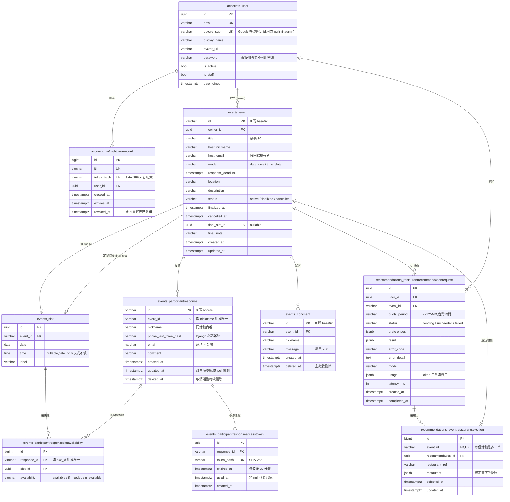

# 7. 資料模型(ER 圖)

本章以 ER 圖(Entity-Relationship Diagram)呈現揪甘心的資料表與關聯,依據 `apps/*/models.py`。Django 內建的資料表(`django_session`、`django_admin_log`、權限相關表等)與業務無關,不列入。

## 7.1 ER 圖

## 7.2 資料表說明

| 資料表 | 用途 | 重點 |
| --- | --- | --- |
| `accounts_user` | 主揪帳號 | 以 `google_sub` 識別身分,email 可能變更所以不當作識別依據;主鍵用 UUID,不暴露帳號數量 |
| `accounts_refreshtokenrecord` | refresh token 撤銷紀錄 | 只存 `jti` 與 SHA-256 雜湊;換發時舊紀錄寫入 `revoked_at` |
| `events_event` | 活動 | 主鍵是 8 碼隨機 base62,同時當作分享網址;`status` 是生命週期狀態(見第 8 章狀態機) |
| `events_slot` | 候選時段 | 每個活動最多 20 個;獨立成表,讓表態可以用外鍵指到特定時段 |
| `events_participantresponse` | 參與者的一次投票 | 同活動暱稱唯一;末三碼存雜湊;取消活動時軟刪除 |
| `events_participantresponseslotavailability` | 投票對每個時段的表態 | 多對多的中介表,多帶一個三態欄位;改票時整批刪除後重建 |
| `events_participantresponseaccesstoken` | 改票用的一次性憑證 | 只存雜湊;`used_at` 以條件式 UPDATE 寫入,保證只能用一次 |
| `events_comment` | 留言 | 與投票完全獨立;主揪刪除時軟刪除 |
| `recommendations_restaurantrecommendationrequest` | AI 推薦紀錄 | 同時是**額度計次的來源**:本月已用 = succeeded + 未滿 5 分鐘的 pending,不另存計數器 |
| `recommendations_eventrestaurantselection` | 活動選定的餐廳 | 每個活動一筆,換選就覆蓋;`restaurant` 存快照,活動詳情直接讀取 |

## 7.3 約束與索引

| 類型 | 位置 | 保證什麼 |
| --- | --- | --- |
| 唯一 | `accounts_user.email`、`google_sub` | 一個 Google 帳號只對應一個使用者 |
| 唯一 | `(event_id, nickname)` | 同一活動內暱稱不重複,改票時才能用暱稱找到人 |
| 唯一 | `(response_id, slot_id)` | 一筆投票對同一時段只有一個表態 |
| 唯一 | `token_hash`(兩張 token 表) | 雜湊查詢唯一對應一筆紀錄 |
| 唯一(OneToOne) | `eventrestaurantselection.event_id` | 每個活動最多選定一間餐廳 |
| 索引 | `(user, quota_period, status)` | 計算本月額度時不掃全表 |
| 索引 | `(user, event, status)` | 檢查「同活動是否已有進行中的推薦」 |

## 7.4 刪除行為

- **CASCADE**:刪除使用者會連帶刪除其活動、refresh token 紀錄與推薦紀錄;刪除活動會連帶刪除時段、投票、表態、留言、推薦與選定餐廳。目前產品沒有提供刪除使用者或活動的 API,只有 Django admin 能做。
- **SET NULL**:`events_event.final_slot_id`——時段被刪除時,定案時段改為 null,不會連帶刪除活動。
- **軟刪除**:投票(取消活動時)與留言(主揪刪除時)只寫入 `deleted_at`,資料保留;所有查詢都會排除 `deleted_at` 非 null 的資料。
