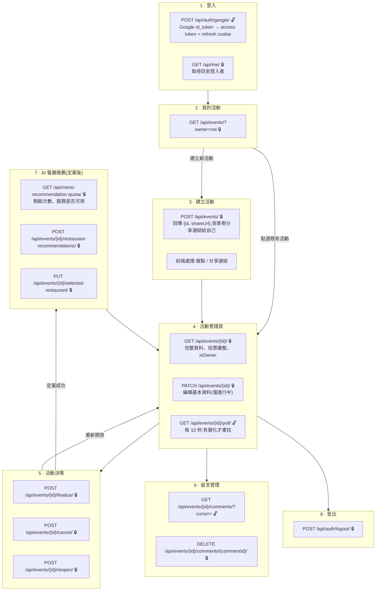
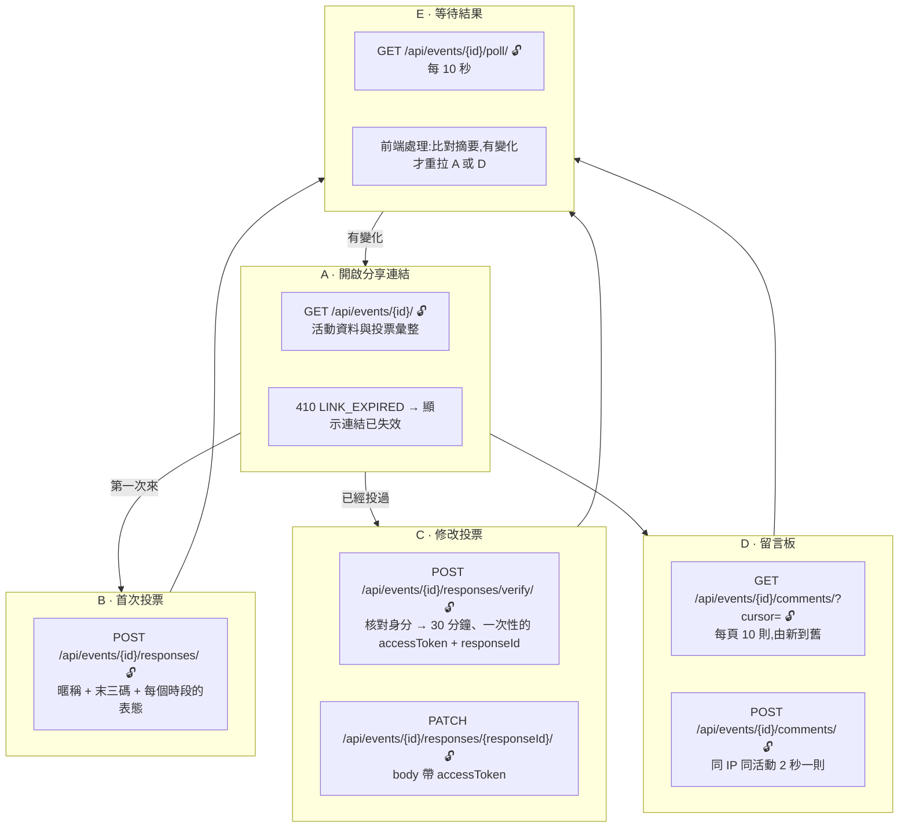
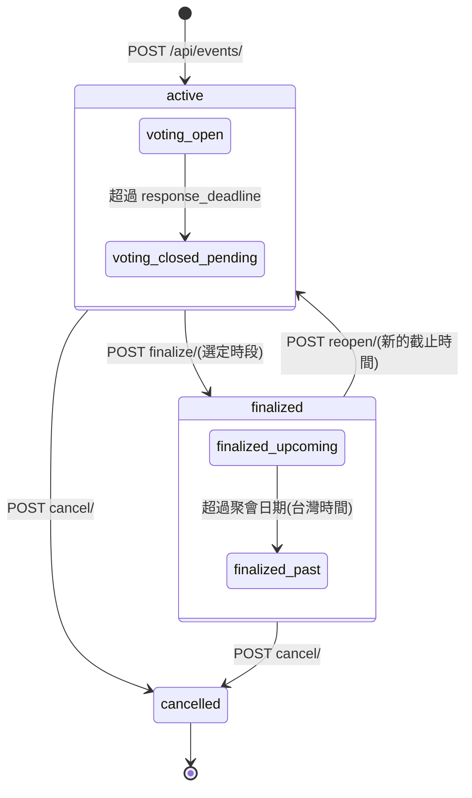

# 8. UML:使用者流程與後端 API 對照

本章用 UML 的**活動圖**(使用者流程)與**狀態機圖**(活動生命週期),把產品流程的每一步對應到前端要呼叫的後端 API,方便前後端串接與檢查。

- 所有路徑都以 `/api` 開頭,而且**結尾都有斜線**(例如 `/api/events/{id}/poll/`)。
- `{id}` 是 8 碼 base62 的活動 id;`{responseId}`、`{commentId}` 也是 8 碼 base62。
- 🔒 代表需要 `Authorization: Bearer <access token>`;🔓 代表免登入。
- 「前端處理」代表這一步不需要呼叫後端。

## 8.1 主揪流程

**access token 過期時(任一步驟收到 401):** 前端呼叫 `POST /api/auth/refresh/` 🔓(瀏覽器自動帶 refresh cookie),拿到新的 access token 後重送原本的請求;refresh 也失敗時,回到步驟 1 重新登入。

## 8.2 參與者流程

**前置條件(B、C 共用):** 連結失效回 410 `LINK_EXPIRED` → 活動不是進行中回 409 `EVENT_NOT_ACTIVE` → 已過截止時間回 409 `VOTING_CLOSED`。留言(D)只檢查連結是否失效。

## 8.3 活動生命週期(狀態機)

- 外層的 `active`、`finalized`、`cancelled` 是資料庫的 `status`;內層是 API 回傳的 `displayStatus`,由時間推算,不寫入資料庫。
- 定案或取消超過 7 天,公開端點一律回 410,`displayStatus` 為 `link_expired`;主揪的取消與重新開放不受影響。
- 每個轉換都是條件式 UPDATE:狀態不符時回 409(例如重複定案回 `EVENT_ALREADY_FINALIZED`),不會發生兩個請求同時轉換成功。
- 定案、取消、重新開放成功後,背景寄通知信給留過 email 的參與者與主揪。
- AI 推薦與選定餐廳只在 `finalized_upcoming` 時可用;投票只在 `voting_open` 時可用。

## 8.4 API 一覽

| 步驟 | 方法與路徑 | 認證 | 誰能用 |
| --- | --- | --- | --- |
| 主揪 1 | `POST /api/auth/google/` | 🔓 | 任何人(用 Google id_token) |
| 主揪 1 | `GET /api/me/` | 🔒 | 已登入主揪 |
| 全部 | `POST /api/auth/refresh/` | refresh cookie | 已登入主揪 |
| 主揪 8 | `POST /api/auth/logout/` | 🔒 | 已登入主揪 |
| 主揪 2 | `GET /api/events/?owner=me` | 🔒 | 已登入主揪 |
| 主揪 3 | `POST /api/events/` | 🔒 | 已登入主揪 |
| 主揪 4、參與者 A | `GET /api/events/{id}/` | 選填 | 任何人;擁有者多看到 `hostEmail` |
| 主揪 4 | `PATCH /api/events/{id}/` | 🔒 | 擁有者 |
| 主揪 4、參與者 E | `GET /api/events/{id}/poll/` | 🔓 | 任何人 |
| 參與者 B | `POST /api/events/{id}/responses/` | 🔓 | 任何人 |
| 參與者 C | `POST /api/events/{id}/responses/verify/` | 🔓 | 任何人 |
| 參與者 C | `PATCH /api/events/{id}/responses/{responseId}/` | accessToken | 投票本人 |
| 主揪 6、參與者 D | `GET /api/events/{id}/comments/` | 🔓 | 任何人 |
| 參與者 D | `POST /api/events/{id}/comments/` | 🔓 | 任何人 |
| 主揪 6 | `DELETE /api/events/{id}/comments/{commentId}/` | 🔒 | 擁有者 |
| 主揪 5 | `POST /api/events/{id}/finalize/` | 🔒 | 擁有者 |
| 主揪 5 | `POST /api/events/{id}/cancel/` | 🔒 | 擁有者 |
| 主揪 5 | `POST /api/events/{id}/reopen/` | 🔒 | 擁有者 |
| 主揪 7 | `GET /api/me/ai-recommendation-quota/` | 🔒 | 已登入主揪 |
| 主揪 7 | `POST /api/events/{id}/restaurant-recommendations/` | 🔒 | 擁有者 |
| 主揪 7 | `PUT /api/events/{id}/selected-restaurant/` | 🔒 | 擁有者 |

非產品 API:`GET /healthz/`(健康檢查)、`GET /metrics`(需 `METRICS_TOKEN`,對外由 nginx 封鎖)、`/admin/`(Django 管理後台)。
