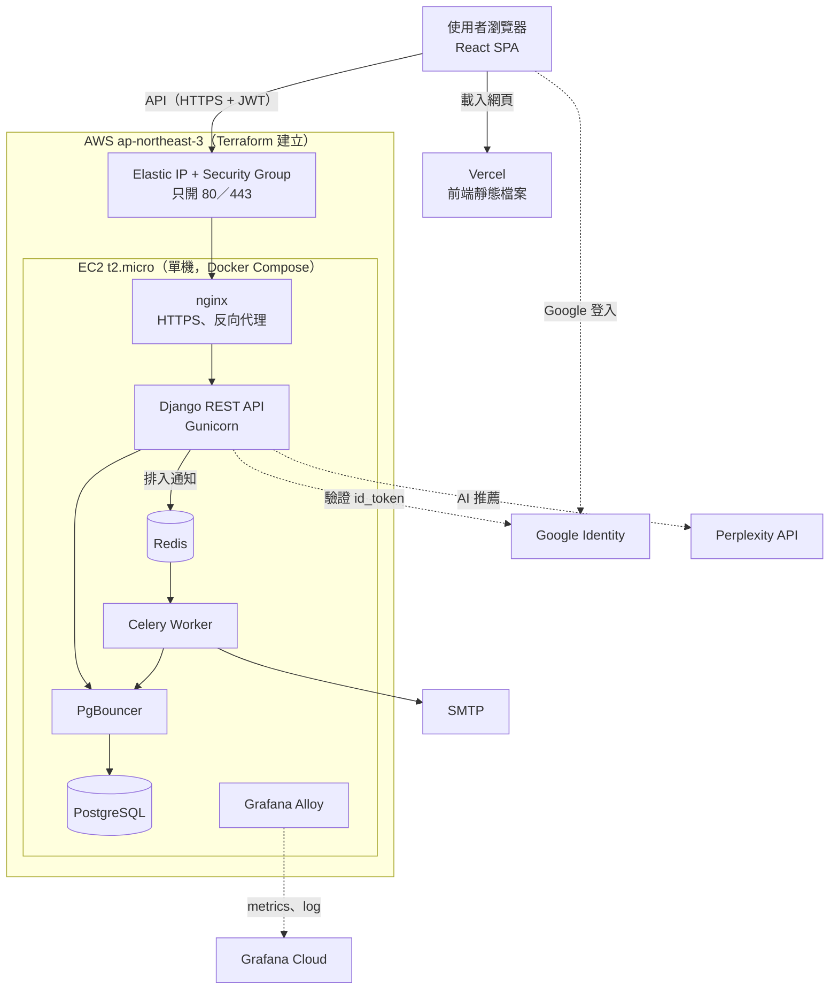

# PM × ENG 跨組交流專案｜技術架構文件

| 項目 | 內容 |
| --- | --- |
| 專案名稱 | 揪甘心 - 聚會時間協調神器 |
| 組別 | 第三組 |
| 水手 | 黃信愷 (KK)、黃郁雯 (Ilene) |
| 航海士 | Fane |
| 文件更新日期 | 2026-10-01 |

主揪用 Google 登入建立活動，把連結丟進 LINE 群組；朋友免註冊投票，主揪看彙整結果一鍵定案，定案後可請 AI 推薦餐廳。

---

## 1. 應用程式架構圖

| 層 | 技術選擇 | 理由 |
| --- | --- | --- |
| 前端 | Vite + React 19 + TypeScript 純 SPA，部署到 Vercel | 活動連結是隨機 ID、不需 SEO，不必 SSR；前端不用維運伺服器 |
| 資料更新 | 每 10 秒輪詢輕量 poll API，分頁在背景時暫停 | 約時間不需秒級即時，不必引入 WebSocket |
| 後端 | Django REST Framework + PostgreSQL，PgBouncer 管理連線 | 交易與 ORM 完整，適合以資料一致性為重點的業務 |
| 非同步 | Celery + Redis 寄通知信 | 寄信慢或失敗都不影響使用者操作 |
| 基礎設施 | Terraform 建立 EC2、EIP、Security Group、IAM；不開 SSH，維運走 AWS SSM | 機器可重建；對外只有 80／443 |
| 交付 | 前端推上 Vercel；後端 CI 建置 image 推到 GHCR，經 SSM 部署到 EC2 | 前後端各自獨立上線 |
| 可觀測性 | Grafana Alloy 收集延遲、錯誤率、資源與 log，推到 Grafana Cloud | 不在請求路徑上，壞掉不影響服務 |

---

## 2. 介面使用者體驗設計

**關鍵流程：建立活動 → 分享連結 → 免登入投票 → 彙整結果 → 一鍵定案**

PRD 的兩個成功指標是**定案天數**與**投票完成率**，都由這條流程決定：主揪的步驟越少，越能取代在 LINE 群組來回確認；參與者越省事，填完的人越多。

| 設計 | 目的 |
| --- | --- |
| 投票只要暱稱 + 手機末三碼，email 選填；改票用同一組資料核對 | 不註冊也能投，又不會被別人隨意改票 |
| 時段預設「有空」，只需改掉不行的 | 減少點擊；代價是分不出「沒看到」和「真的有空」 |
| 結果依支持度排序，先顯示前 3 名 | 主揪不用逐筆比對 |
| 定案時自動寄信、產生出席名單、提供可複製的定案文字 | 取代主揪手動整理、逐一通知 |
| 每 10 秒同步，狀態由後端用台灣時間統一計算 | 多人同時看時畫面一致 |
| LINE 內建瀏覽器與 Safari 引導改用 Chrome 開啟 | 前者擋 Google 登入，後者擋跨網站的登入 cookie |

---

## 3. 擴展設計

**規模：** 輕量工具，PRD 訂單一活動上限 50 人、20 個時段。流量是分享後的一波集中投票，加上輪詢（同時開著頁面的人數 ÷ 10 ≈ RPS）。

**已做的設計**

- 前端是 CDN 上的靜態檔案；輪詢只拿摘要，有變化才重拉完整資料。
- PgBouncer 讓 12 個 API 執行緒共用 10 條資料庫連線；寄信移到 worker。
- API 用 JWT、不存 session：資料庫與 Redis 搬出後，API 可直接水平擴展。
- AI 推薦有每人每月額度，且同一活動同時只能一個請求。

**效能測試：** 尚未做負載測試，CI 只有 k6 smoke test。目標為 P95 < 500 ms、5xx < 1%、約 100 RPS，可由 Grafana 依 API 觀測。

**已知限制與路線：** 目前單台 1GB EC2，只能垂直擴展。依序規劃：資料庫備份 → 升級規格 → 拆出 RDS／ElastiCache → ALB + ECS 水平擴展。

---

## 4. 容錯性設計

| 情況 | 處理方式 |
| --- | --- |
| 寄信失敗 | 定案等操作照常成功，錯誤記 log（PRD FR-6）；commit 後才排入，不會「信寄了資料沒存」 |
| AI 逾時或失敗 | 45 秒逾時，回 504／502，不扣次數，其他功能不受影響 |
| 輪詢失敗 | 保留上次資料，下一輪再試；活動失效（404／410）就停止 |
| access token 過期 | 前端自動用 refresh cookie 換新再重送，多個請求只換一次 |
| 兩人同時定案、同一改票憑證送兩次 | 資料庫條件式 UPDATE，只有一個成功，另一個回 409／401 |
| 多筆寫入（如取消活動並清除投票） | 同一個交易，一起成功或一起失敗 |

錯誤統一回傳 `{message, code}`，前端可直接顯示中文訊息，並依 `code` 決定下一步。

---

## 5. 安全性設計

| 風險 | 處理 |
| --- | --- |
| 主揪帳號被冒用 | Google id_token 驗證簽章、效期、audience 與 email 驗證狀態 |
| token 外洩 | access token 30 分鐘；refresh token 14 天，放 `HttpOnly` cookie（JS 讀不到），每次換發即作廢舊的，資料庫只存雜湊 |
| 管理別人的活動 | 所有主揪操作在後端檢查擁有者，不信任前端 |
| 猜出活動網址 | 8 碼隨機 ID，約 218 兆種組合 |
| 參與者個資外洩 | API 不回傳參與者 email；通知信一人一封；末三碼加鹽雜湊 |
| 伺服器被入侵 | 只開 80／443、不開 SSH；資料庫不對外；EC2 只有 SSM 權限 |

取捨：前後端不同網域，access token 存在 `localStorage`，XSS 仍可能偷到，以短效期降低影響。

**尚未處理：** 末三碼只有 1,000 種組合且核對 API 無次數限制；前端沒有 CSP。

---

## 6. Technical Debt Log

| 優先 | 項目 | 為什麼這樣做 | 之後怎麼改 |
| --- | --- | --- | --- |
| P0 | 資料庫沒有備份 | 先求環境可用 | 每日 snapshot 並演練還原 |
| P0 | 改票核對可被暴力嘗試 | 免登入是核心體驗 | 依活動、暱稱、IP 限制失敗次數 |
| P1 | 單台 EC2 跑全部服務 | MVP 成本最低 | 拆出 RDS／ElastiCache，再接 ALB + ECS |
| P1 | 沒有告警 | dashboard 先完成 | 建立 5xx、記憶體、服務中斷告警 |
| P1 | 前端沒有錯誤頁與「連結已失效」頁 | 先完成主流程 | Error Boundary、404 與失效頁 |
| P1 | 前端沒有錯誤監控 | 先建後端觀測 | 導入 Sentry |
| P2 | 前端缺 E2E 與元件測試 | 單元測試先顧核心邏輯 | Playwright 測建立活動、投票改票 |
| P2 | 名冊的 email 標記沒有資料 | 後端尚未提供 `hasEmail` | 後端補欄位 |
| P2 | 50 人上限未實作 | 先完成主流程 | 後端建立投票時檢查 |
| P2 | Safari／LINE 要改用 Chrome | 前後端不同網域 | 購買網域，前後端同主網域 |

**已解決：** 主揪驗證由 hostToken 改為 Google 登入；AI 餐廳推薦與編輯活動（FR-8）已完成前後端串接。

---

## 其他補充

- **規格驅動開發：** 每個功能先寫 proposal／design／tasks 再實作；後端 CI 規定改程式碼必須同步更新規格文件。
- **後端 CI：** lint、測試、migration 一致性、經 PgBouncer 再跑一次測試、k6 smoke test。
- **詳細文件：** 後端 repo `docs/report/` 有完整分章、ER 圖與 API 對照。
