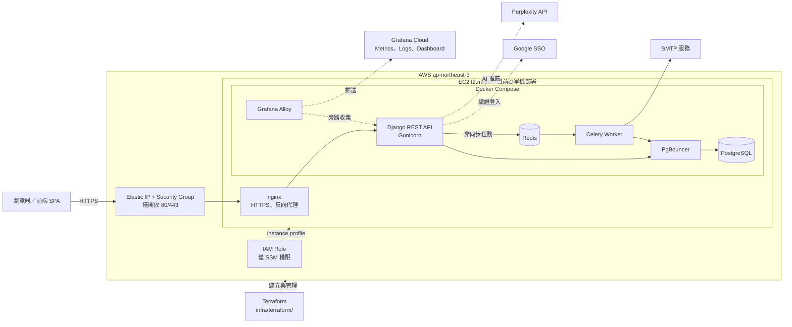
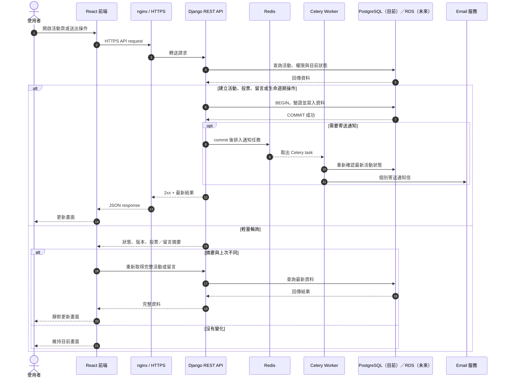
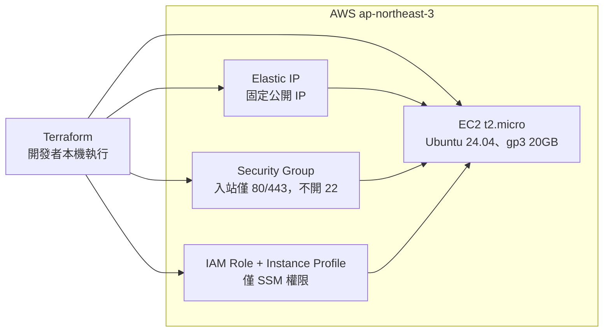

# 揪甘心後端技術報告

> 文件基準：`develop`，2026-10-01  
> 專案：`jiu-sync-backend`

## 摘要

「揪甘心」是一個協助朋友快速約時間的揪團服務。主揪使用 Google 帳號登入後建立活動與候選時段，再把連結分享給參與者；參與者不必註冊帳號，只要填寫暱稱與手機末三碼即可投票、修改選擇或留言。主揪可以依投票結果定案、取消或重新開放活動，也可以在定案後取得 AI 餐廳建議。

後端採用 Django REST Framework，主要資料存放於 PostgreSQL，Redis 負責非同步工作佇列與留言限流，通知信由 Celery worker 處理。正式環境目前部署在單台 AWS EC2，並透過 Grafana Cloud 收集 metrics 與 log。整體設計以「低使用門檻、資料一致性與 MVP 維運成本」為優先；高可用、完整備份與大規模水平擴展則列為後續改善項目。

---

## Functional Requirements

以下是目前產品需要提供的主要功能。

| 編號 | 使用者需求 | 系統行為 |
| --- | --- | --- |
| FR-01 | 主揪登入 | 使用 Google SSO 驗證身分，核發短效 access token，並以 HttpOnly cookie 保存 refresh token。 |
| FR-02 | 建立與管理活動 | 主揪可建立活動、候選時段、截止時間、地點與說明，並查詢自己建立的活動。 |
| FR-03 | 分享活動 | 系統產生不可預測的短網址識別碼，建立後將分享連結回傳並寄給主揪。 |
| FR-04 | 參與者投票 | 參與者不需登入，即可用暱稱與手機末三碼對每個時段表達「可以／勉強可以／不行」。 |
| FR-05 | 修改投票 | 參與者先核對暱稱與手機末三碼，取得 30 分鐘內有效且只能使用一次的憑證，再修改投票。 |
| FR-06 | 留言互動 | 任何持有有效活動連結的人可查看及新增留言；主揪可軟刪除不適當留言。 |
| FR-07 | 活動生命週期 | 主揪可定案最終時段、取消活動，或把已定案活動重新開放投票。 |
| FR-08 | 即時狀態更新 | 前端以輕量 poll API 判斷投票、留言或活動是否改變，需要時再取得完整資料。 |
| FR-09 | 通知信 | 建立、定案、取消與重新開放後，系統非同步寄送通知，不阻塞主要 API。 |
| FR-10 | AI 餐廳推薦 | 活動定案後，主揪可在每月額度內取得 AI 餐廳建議並選定餐廳。 |
| FR-11 | 一致的錯誤回應 | API 以固定格式回傳中文訊息、機器可讀代碼及欄位錯誤，供前端顯示與流程分流。 |

## Non-functional Requirements

| 類別 | 需求與目前處理方式 |
| --- | --- |
| NFR-01 可用性 | 核心 API 發生通知信、Redis 限流或觀測系統異常時，應盡量維持主要流程可用。 |
| NFR-02 效能 | 一般 API 的目標可參考 P95 500ms；高頻 poll API只回摘要，不回完整投票與留言。AI API 因外部服務特性另行評估。 |
| NFR-03 容量 | Python API 可先以約 100 RPS 作為壓測參考，而非已達成數值；目前尚未完成正式容量測試。 |
| NFR-04 錯誤率 | HTTP 500 Error Rate 以低於 1% 為觀察目標，透過 metrics 與 log 持續確認；目前尚未累積足夠正式流量數據。 |
| NFR-05 一致性 | 狀態轉換、一次性憑證與 AI 額度使用資料庫條件式更新、唯一約束或列鎖保證。 |
| NFR-06 安全性 | 主揪端點需要認證與擁有者授權；refresh token 使用 Secure、HttpOnly cookie；敏感資料不得明文儲存或出現在 log。 |
| NFR-07 可觀測性 | 收集 API 延遲、錯誤率、主機與 container 資源、應用程式與 nginx log；觀測系統不得位於核心請求路徑。 |
| NFR-08 可維護性 | 功能變更需同步 OpenSpec、migration 與測試；CI 執行 lint、測試、migration drift、PgBouncer 相容性及 smoke test。 |
| NFR-09 可擴展性 | API container 本身不保存 session 狀態；未來將 PostgreSQL、Redis 拆成代管服務後，可水平擴展 app 與 worker。 |
| NFR-10 隱私 | 投票者 Email 與手機末三碼不得公開；通知信需逐一寄送，避免收件者互相看到 Email。 |

> 上述效能與錯誤率是設計目標，不是目前已驗證的 SLA。報告刻意區分「已完成設計」與「尚待量測」，避免把參考門檻寫成實測成果。

---

## 1. 應用程式架構圖



### 1.1 使用者請求序列圖

下圖以「使用者開啟活動、送出操作，後端完成資料寫入並非同步通知」為例。前端實際會透過 `src/api/eventsApi.ts` 呼叫活動、投票、留言與 poll API；需要登入的主揪操作則由共用 HTTP client 自動帶上 access token。



Redis 不負責保存核心活動資料；它主要用於 Celery 任務佇列與短期留言限流。活動、投票、留言及使用者資料仍以 PostgreSQL 為唯一事實來源。未來若改用 AWS RDS，只是把 PostgreSQL 從 EC2 container 搬到代管服務，API 的主要資料流程不需要重新設計。

### 架構說明

- **nginx 是唯一對外入口**，負責 TLS 終止與反向代理；PostgreSQL、Redis 和 metrics 端點不直接暴露到網際網路。
- **Django REST API 處理核心業務**，包含登入、活動、投票、留言、生命週期與 AI 推薦。
- **PgBouncer 控制資料庫連線數**，避免多個 Gunicorn 執行緒與 Celery worker 直接耗盡 PostgreSQL 連線。
- **Celery 將通知信移出請求流程**。資料成功提交後才排入任務，因此寄信失敗不會把已完成的活動操作變成失敗。
- **Grafana Alloy 是旁路元件**。即使觀測服務中斷，API 仍可運作。

目前所有服務位於同一台 EC2，適合 MVP 與低流量階段，但也是單點故障。完整部署與觀測架構可參考附錄 `01-architecture.md`。

### 1.2 基礎設施即程式碼（Terraform IaC）

AWS 資源以 Terraform 宣告於 `infra/terraform/`，讓環境可以重複建立，不依賴手動在 Console 操作。



| 設計 | 做法與理由 |
| --- | --- |
| 不開 SSH | 不建 key pair、不開 22 port；維運與部署都透過 AWS SSM，對外攻擊面只剩 80/443。 |
| 機器身分與操作者分離 | EC2 使用只有 `AmazonSSMManagedInstanceCore` 的 IAM role，機器上不存放長期 AWS 金鑰。 |
| AMI 動態查詢 | 以 Canonical 官方帳號過濾最新 Ubuntu 24.04，避免寫死會過期的 AMI ID 或拿到非官方映像。 |
| 固定 IP | Elastic IP 讓機器重啟後位址不變，`sslip.io` 網域與前端設定不必跟著改。 |
| 單一 root module | 資源數量少，不拆 module，降低單人維護成本。 |

Terraform 只負責「把機器開出來」；Docker、nginx、TLS 憑證與 `.env` 目前仍以 SSM 手動設定，應用程式則由 `deploy.sh` 部署。state 存在開發者本機，之後應改用 S3 backend；這些限制列於 Technical Debt Log。

---

## 2. 介面使用者體驗設計

### 2.1 參與者免登入投票

產品最重要的體驗是「拿到連結後可以立刻投票」。若要求每位朋友註冊帳號，會提高放棄率；但完全不驗證，又可能讓其他人任意改票。

因此系統採取折衷方式：首次投票只需要暱稱與手機末三碼；修改投票時再次核對這兩項資料，成功後核發短效、一次性的修改憑證。手機末三碼只保存雜湊，不保存明碼。這個設計降低參與門檻，但末三碼只有 1,000 種組合，仍需在後續加入嘗試次數限制。

### 2.2 錯誤訊息可以直接協助使用者

所有 API 錯誤使用固定結構：

```json
{
  "message": "投票已截止",
  "code": "VOTING_CLOSED"
}
```

欄位驗證錯誤會一次列出所有問題，前端可以同時標示，不必讓使用者逐次提交才發現下一個錯誤。不同的活動狀態也有明確代碼，例如已取消、已定案或投票截止，讓前端提供正確下一步，而不是只顯示「發生錯誤」。

### 2.3 多人畫面同步

前端每 10 秒呼叫輕量 poll API，只取得狀態、資料版本、投票與留言摘要。有變化時才重新取得完整活動內容，兼顧畫面即時性與流量。活動顯示狀態由後端依台灣時區統一計算，避免不同裝置自行判斷造成不一致。

### 2.4 分享連結與留言

建立活動後，系統會把分享連結寄給主揪，降低關閉頁面後找不到連結的風險。留言採 cursor pagination，每頁由新到舊載入 10 則；新增留言另有簡單限流，避免連續點擊造成洗版。

---

## 3. 擴展設計

### 3.1 預期使用情境

目前定位為 MVP：單一活動通常只有數位到數十位參與者，主要服務前端整合測試與少量真實使用者。系統沒有宣稱已能承受 100 RPS，也尚未建立正式 SLA。

### 3.2 已完成的效能設計

- 詳情查詢使用 `select_related`／`prefetch_related`，避免投票與時段形成 N+1 query。
- poll API 只回摘要；留言使用 keyset cursor pagination，不使用資料量越大越慢的深頁 offset。
- PgBouncer 採 transaction pooling，讓有限的 PostgreSQL 連線服務更多 app 執行緒。
- 通知信由 Celery 非同步處理；Redis 同時承擔 broker 與短期限流鎖。
- AI 推薦呼叫外部服務期間不持有資料庫鎖，避免長請求阻塞其他操作。

### 3.3 效能測試現況

CI 已有健康檢查與 k6 smoke test，但沒有正式負載測試。因此 P95 500ms、500 error rate < 1% 與 Python 約 100 RPS 目前都只是參考目標，不能寫成已達成成果。

後續應以符合真實比例的情境壓測：多數為 poll，少部分為活動詳情、留言與投票，極少數為 AI 推薦；同時觀察 API P95、錯誤率、CPU、記憶體、swap、資料庫連線與 Celery queue。

### 3.4 擴展路線

1. 先垂直升級 EC2，並完成資料備份。
2. 把 PostgreSQL 搬到 RDS、Redis 搬到 ElastiCache，移除主機內的狀態。
3. 前方加入 ALB，水平擴展 app；worker 則依 queue 長度獨立擴展。
4. 機密改由 Parameter Store 或 Secrets Manager 管理，migration 改為部署時的一次性工作。

---

## 4. 容錯性設計

- **統一錯誤格式。** 已知業務錯誤回傳固定 code；未知例外回傳安全的 500 訊息，詳細內容只留在伺服器 log。
- **資料一致性。** 定案、取消、重新開放、一次性憑證消費及 AI 額度使用資料庫條件式更新或列鎖，避免兩個併發請求同時成功。
- **交易提交後再做副作用。** 通知任務透過 `transaction.on_commit()` 排入；資料回滾時不會誤寄通知。
- **附屬功能降級。** Redis 限流失效時留言主流程採 fail-open；Grafana 無法連線不影響 API；通知排程失敗只記錄錯誤，不回滾核心動作。
- **AI 上游失敗。** 上游逾時或連線失敗會轉成 502／504；預留的額度紀錄標記失敗，不計入使用次數。
- **健康檢查。** `/healthz/` 用於部署與 smoke test，確認 web service 可以回應。

目前主要限制是通知信尚未設定自動重試與 SMTP timeout，也沒有跨主機高可用或自動容錯切換。

---

## 5. 安全性設計

### 已處理的重要風險

- **身分驗證。** Google id_token 會驗證簽章、issuer、audience 與 email 驗證狀態。access token 短效；refresh token 存在 Secure、HttpOnly、SameSite cookie，資料庫只保存其雜湊。
- **權限控制。** 活動修改、定案、取消、重新開放及刪除留言均檢查登入者是否為活動擁有者。
- **敏感資料。** 手機末三碼使用 Django password hasher；參與者 Email 不出現在公開 API；通知信逐一寄送，避免收件者互相看見地址。
- **注入與輸入驗證。** 透過 Django ORM 與 serializer 驗證資料型別、長度、選項及資源歸屬，不拼接 SQL。
- **API 與基礎設施。** 正式環境強制 HTTPS，只開放 80/443；資料庫、Redis 與 `/metrics` 不對外開放；CORS 使用允許清單。
- **Log 保護。** 對外錯誤不含 traceback；送往 Grafana Cloud 前遮蔽 token、JWT 與 Email。

### 尚未充分處理的風險

手機末三碼只有 1,000 種可能，公開核對端點目前缺少失敗次數限制；留言限流對來源 IP 的信任邊界也需要重新確認。此外 `/admin/` 尚未從公開入口封鎖，CI 尚未加入依賴弱點掃描。這些項目應優先於進一步功能擴充。

---

## 6. Technical Debt Log

| 優先級 | 技術債／取捨 | 為什麼目前這樣做 | 風險 | 建議改善 |
| --- | --- | --- | --- | --- |
| P0 | PostgreSQL 沒有自動備份 | MVP 優先完成可用環境 | EC2 或 EBS 故障可能永久遺失資料 | 每日 EBS snapshot 或 `pg_dump` 至 S3，並演練還原 |
| P0 | 手機末三碼可被暴力嘗試 | 免登入投票是核心體驗 | 知道暱稱後最多嘗試 1,000 次即可冒用 | 依活動、暱稱與 IP 設定失敗次數及暫時鎖定 |
| P1 | 所有服務集中在單台 EC2 | 成本低、維運簡單 | 單點故障、資源互搶，無法直接水平擴展 | 先拆 RDS／ElastiCache，再擴展 app 與 worker |
| P1 | 部署仍為半自動 | 先完成 image 建置與 SSM 部署 | 依賴人工；新版可能先於 migration 上線 | 以 image SHA 自動部署，採 expand-and-contract migration |
| P1 | 沒有主動告警 | Dashboard 優先完成 | 故障需等人工查看才知道 | 建立 metrics 中斷、記憶體、5xx、container restart 告警 |
| P2 | AI 推薦同步占用 web thread | 實作簡單、使用頻率低 | 多個慢請求可能拖慢核心 API | 改成 202 + background job + 結果輪詢 |
| P2 | 通知沒有 retry／timeout | 先確保寄信不影響核心 API | 暫時故障會漏信，SMTP 卡住會堵塞 worker | 設定 timeout、有限次數 exponential backoff |
| P2 | nginx、機密與 Terraform state 仍有手動管理 | 單人單環境最快 | 重建困難、多人協作風險高 | 設定即程式碼、Secrets Manager、遠端 Terraform state |
| P3 | 尚未做容量測試 | 優先驗證功能正確性 | 無法以數據判斷可承受流量 | 建立 k6 workload，留下 P50/P95/RPS/error rate 基準 |
| P1 | 前端沒有錯誤處理頁面 | 先完成主要流程 | 渲染錯誤變白畫面；錯誤網址默默回首頁；後端的 404／410 沒有對應畫面 | Error Boundary、404 與連結失效頁，`http.ts` 依錯誤 `code` 統一處理 |
| P1 | 前端沒有錯誤監控（Sentry） | 先建立後端可觀測性 | 使用者端錯誤開發者看不到，也無法與後端 log 對照 | 導入 Sentry 並上傳 source map，回報前遮蔽個資 |
| P2 | 前端沒有 E2E 與 design system 單元測試 | 單元測試優先放在核心邏輯 | 共用元件改壞與前後端串接問題要到正式環境才發現；CI 不跑測試 | CI 加入型別檢查與 Vitest；元件測試；Playwright 測關鍵流程 |

技術債不是單純的缺點清單，而是目前產品階段下的取捨紀錄。詳細背景、已修正事件與實作位置可參考 `06-tech-debt.md`。

---

## 其他補充：工程品質與可觀測性

專案採規格驅動開發。每個重要功能會先建立 proposal、design、requirements 與 tasks，再進入實作；CI 也會檢查程式碼與規格是否同步。自動化測試使用真實 PostgreSQL 與 Redis，並額外透過 PgBouncer 跑相容性測試。

正式環境由 Grafana Alloy 收集 app、container、主機與 nginx 的 metrics／logs，再送往 Grafana Cloud。Dashboard 已涵蓋 API 延遲與錯誤率、container 資源、主機資源及 log；目前仍缺少主動告警與完整資料庫指標。

## 結論

目前架構適合 MVP：它降低參與者使用門檻，也針對併發更新、外部服務失敗及敏感資料建立了明確保護。最大的限制不在功能正確性，而在單機部署、備份、防濫用與容量驗證。下一階段應先補資料備份與公開端點防護，再以真實監控和負載測試決定何時拆分基礎設施，而不是過早投入高成本的分散式架構。
